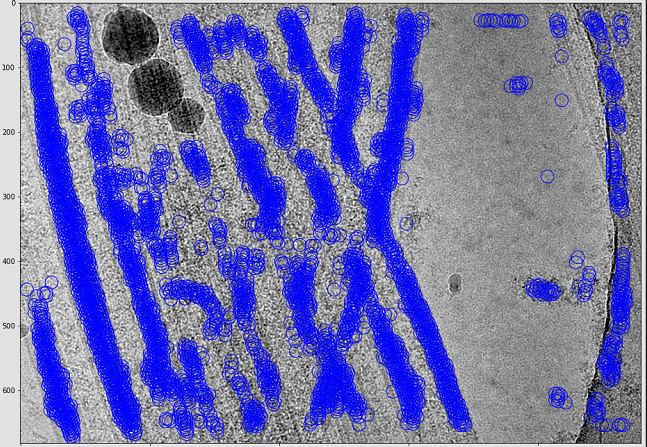
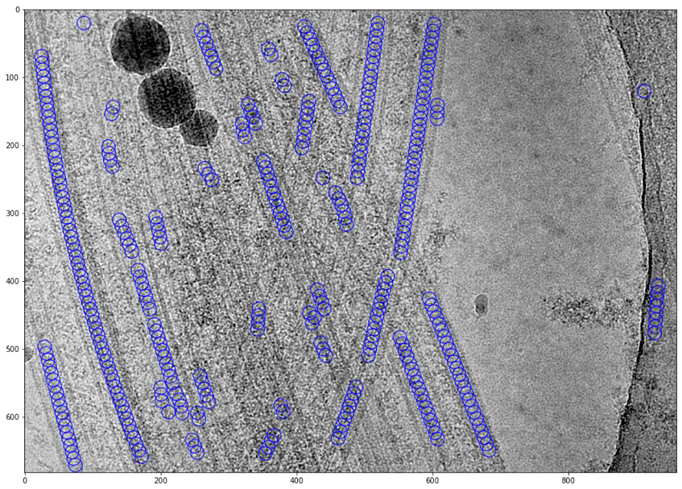

# filament_tool_topaz

filament_tool_topaz is an application to process topaz jobs conducted on micrographs of flamentous molecules

The filament fitting tool is advantageous as it eliminates false/dirty coordinate clusters, improving the efficiency of cryoEM 2D classification jobs as well as identifying equidistant neighbours to improve helical processing of molecules such as microtubules.

## Set up the requirements

Download topaz here: https://github.com/tbepler/topaz

Use the package manager [pip](https://pip.pypa.io/en/stable/) to install the requirements for filament_tool_topaz: pandas and scikit-learn

```bash
pip install scikit-learn
pip install numpy
pip install pandas
```
If you prefer to use anaconda, and have topaz installed in a conda environment, activate the conda environment and install the requirements using

```
conda activate [topaz_environment_name]
conda install [the packages above]
```

## Set up the repository

```bash
git clone [this repository]
cd filament_tool_topaz
```
## Instructions

To work on a newly generated topaz coordinate file, typically in the following format:<br>
image_name	x_coord	y_coord	score<br>
Microtubules_00000	420	586	0.6130168<br>
Microtubules_00000	881	475	-0.32318813<br>
Microtubules_00000	514	359	-0.6220623<br>
Microtubules_00000	541	107	-0.7319106<br>
Microtubules_00000	578	382	-0.7987223<br>
Microtubules_00000	489	529	-0.81050706<br>
...

```bash
python src/topaz_to_filament.py [topaz_coordiante_file_PATH] [destination_folder_PATH]
```

This slices the topaz coordiante file into corresponding files for each micrograph, files of this type are referred to as "filament coordiante file" format

To perform filament fitting on filament coordinate files, run the following command, which generates the fitted coordinate files using DBSCAN clustering and RANSAC regression, as well as png figures for each micrograph showing the results.

```bash
python src/filament_trace.py [destination_folder_PATH (ie. the filament coordinate files' location)]\
                             [destination_folder_PATH for fitted filament coordiantes]\
                             [spacing (euclidean distance between neighbouring fitted coordinates)]\
                             -t [topaz_particle_threshold]\
                             -eps [max distance between two coordinates to be considered neighbours for DBSCAN fitting]\
                             -min_samples [The number of samples in a neighbourhood for a point to qualify as a "core" [point]
                             --im [if set to 1, will save a png figure for each fitted example for visualization]
```
see example below, typically, eps depends on the resolution of the micrographs, but min_samples should be set to around 3-7

```bash
python src/filament_trace.py filament_mode_coordinates fitted_plots 10 -t -3.25 -eps 10 -min_samples 4 -im 1
```

## Results

Pre-fitting: 


Post-fitting: equidistant cooridnates along filaments for helical processing


## Contributing
Pull requests are welcome. For major changes, please open an issue first to discuss what you would like to change.

Please make sure to update tests as appropriate.
